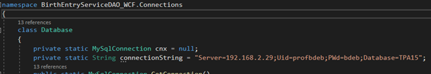
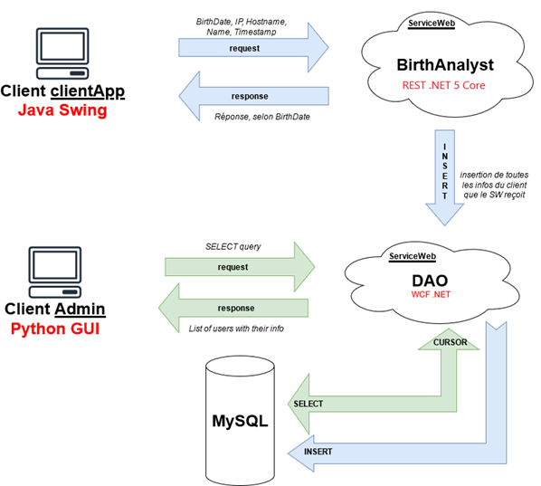

# TPServices-AllServicesAndClient

# Introduction

Ce projet est divisé en 4 parties :

1. _Dans le dossier « BirthEntryServices »_ :

La solution Visual Studio nommée « BirthEntryServices » comprenant les 2 projets suivants :

  1. **BirthEntryServiceDAO\_WCF**
  2. **BirthService\_REST**

1. _Dans le dossier « UserClient-Java »_

Le projet Netbeans nommé : «  **UserClient**  ».

1. _Dans le dossier « AdminClient-Python »_

Le répertoire «  **AdminClient**. Le fichier de démarrage étant : « main.py », à la racine du répertoire.

1. Le fichier « dates\_of\_birth.sql » dans le dossier « Database ».

#
# BirthEntryServiceDAO\_WCF - C# .NET Framework

- Service WCF qui sert de service « DAO ». C&#39;est ce service qui exécute le code lié à la base de données.
- IMPORTANT : Changer la connectionString dans la classe Database.cs (Package : Connections)

- Ce service est référencé dans le projet «  **BirthService\_REST**  » en tant que «  **Connected Service**  »
- C&#39;est le service avec lequel le client admin «  **AdminClient**  » communique.
- Réalisé avec .NET Framework 4.8

#
# BirthService\_REST - C# .NET CORE 5

- Service REST qui permet de d&#39;obtenir « la destinée » d&#39;un individu selon sa date de naissance. Permet aussi d&#39;envoyer une requête au service « BirthEntryServiceDAO\_WCF » pour qu&#39;il ajoute de nouvelles insertions d&#39;utilisateurs dans la base de données.
- Ce service est utilisé dans le projet «  **UserClient** » à l&#39;aide de la classe **HttpURLConnection**
- Les URL servant à appeler les méthodes sont :

Prendre note que le numéro de port pourrait être différent :

  1. [http://localhost:5000/api/Birth/getActivity/?BirthDate=1973-11-02](http://localhost:5000/api/Birth/getActivity/?BirthDate=1973-11-02)
  2. [http://localhost:5000/api/Birth/AddUserToDatabase/?](http://localhost:5000/api/Birth/AddUserToDatabase/?) + query

query : Username, Hostname, LocalIP, PublicIP, EntryDate,BirthDate

#
# UserClient - Java

**« self-explanatory»**

#
# AdminClient – Python

- IMPORTANT : Changer la connectionString dans le fichier database.py (Dossier : modules) 
- 

Je voulais m'amuser avec Python 😝 😊

#
# Schéma global du travail réalisé

